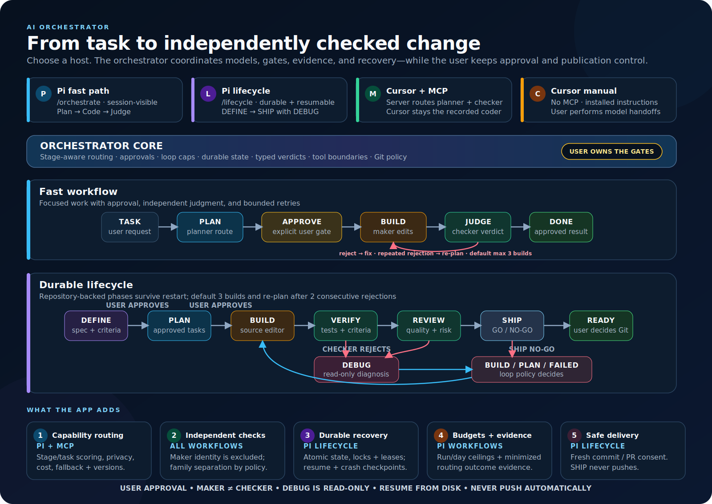

# AI Orchestrator

AI Orchestrator separates planning, implementation, and checking instead of asking one model to approve its own work. It provides:

- **Pi fast path:** `/orchestrate` runs an approval-gated Plan → Code → Judge loop.
- **Pi lifecycle:** `/lifecycle` runs a durable DEFINE → PLAN → BUILD → VERIFY → DEBUG → REVIEW → SHIP workflow.
- **Cursor with MCP:** the MCP server plans, previews trusted planner/checker routes, and judges evidence supplied by Cursor.
- **Cursor without MCP:** installed Markdown instructions preserve the same gates with manual model handoffs.

The working tree is never reverted automatically. SHIP never pushes. Built-in model names are defaults or preferences, not universal requirements.

## Workflow and features at a glance

[](docs/images/ai-orchestrator-workflow.svg)

[Open the workflow canvas at full size](docs/images/ai-orchestrator-workflow.svg).

How to read the canvas:

1. **Choose where you work.** Pi can run the fast or durable workflow; Cursor can use MCP-routed planner/checker calls or manual model handoffs.
2. **Keep the user at the gates.** Plans require approval by default, and routing metadata never grants permission to edit, commit, or publish.
3. **Use the fast loop for focused changes.** PLAN → approval → BUILD → independent JUDGE; rejection returns actionable fixes, and repeated rejection re-plans within bounded attempts.
4. **Use the lifecycle for durable work.** DEFINE → PLAN → BUILD → VERIFY → REVIEW → SHIP persists state on disk. VERIFY or REVIEW rejection enters read-only DEBUG before BUILD applies a diagnosis.
5. **Rely on the safety spine.** Capability routing, maker/checker separation, restart recovery, budgets/minimized evidence, and fresh Git confirmations apply around the workflow. SHIP evaluates readiness but never pushes.

## Documentation

- [Setup guide](docs/setup.md): install Pi or Cursor, configure trusted MCP providers/models, and verify the installation.
- [User guide](docs/user-guide.md): run the fast path, durable lifecycle, routing operations, Cursor handoffs, recovery, and publication gates.
- [Configuration and trust boundaries](#configuration-and-trust-boundaries): complete routing/catalog reference and security model.
- [Troubleshooting](#troubleshooting): common Pi, Cursor, MCP, routing, and recovery problems.

## Architecture and surface parity

All surfaces use the same pure routing concepts: stage requirements, task features, capability profiles, pins/preferences, deny rules, cost-aware ranking, policy versions, and maker/checker separation. The fast planner maps to `plan`; the fast judge maps to `fast-judge`, a combined verification/review policy. Existing loop state machines remain authoritative for counters and escalation.

The adapters intentionally differ where their hosts differ:

| Surface | Model source and activation | Files and evidence | Intentional limitation |
| --- | --- | --- | --- |
| Pi fast path | Discovers callable models from Pi's local registry and can switch Pi automatically | Keeps session-visible routing state | No durable lifecycle run directory |
| Pi lifecycle | Discovers callable models from Pi and can switch every stage, including BUILD | Persists state, routing traces, and minimized evidence under the run directory | Pi ignores `mcp.providers` and `mcp.models` |
| MCP | Calls planner/judge candidates from the trusted user `mcp.models` catalog through trusted user providers | Does not read project files or write run artifacts; returns routing metadata to the client | Cannot discover Pi or Cursor models and does not route Cursor's coder |
| Cursor instructions | The user selects the Cursor model manually and records its identity | Cursor gathers repository context, diffs, tests, and optional run notes | Markdown cannot switch models or prove host availability |

For MCP, Cursor supplies the task, repository context, diff, tests, loop counters, and coder identity. The server treats supplied text as untrusted data and does not inspect the repository.

## Design influences and deliberate differences

The project uses Geoffrey Huntley’s [Ralph Wiggum technique](https://ghuntley.com/ralph/) as an iteration discipline: keep specifications and the prioritized plan in repository state, search before assuming work is missing, take one highest-value item per loop, and apply fast build/test backpressure before the next loop. It does **not** copy Ralph as an unattended greenfield Bash loop. This package targets existing repositories where deterministic state machines, bounded attempts and spend, independent checking, human gates, and recoverable artifacts are required.

The supplied reference architecture can be summarized as:

```text
                         USER
                  (approval gate owner)
                           |
                       ORCHESTRATOR
            coordination · gates · Git policy
               (never authors feature code)
                 /          |          \
            PLANNER     IMPLEMENTER    CHECKERS
             plan       source + tests  verdict + smoke evidence
```

AI Orchestrator preserves those ownership boundaries but deliberately uses host-native mechanics rather than reproducing the diagram exactly. Pi switches role models inside one session; the durable lifecycle adds DEFINE, read-only DEBUG, and SHIP; MCP routes only its server-side planner/checker while Cursor remains the manually selected implementer. In every surface, the latest maker identity is excluded from checking, and Git publication remains orchestrator-owned and explicitly gated.

## Requirements

- Node.js 20 or newer.
- Pi workflows: Pi with the intended models authenticated in its local registry.
- MCP workflows: trusted user provider credentials and, for capability routing, a trusted user model catalog and capability profiles.
- Git is recommended because checkers review diffs and lifecycle runs record per-worktree evidence.

## Choose a workflow

| Environment | Install | Start with |
| --- | --- | --- |
| Pi fast path | `pi install npm:ai-orchestrator` | `/orchestrate <task>` |
| Pi lifecycle | `pi install npm:ai-orchestrator` | `/lifecycle <task>` |
| Cursor with MCP | `npx ai-orchestrator install-cursor` | Ask Cursor to use the AI Orchestrator workflow |
| Cursor without MCP | `npx ai-orchestrator install-cursor --no-mcp` | Follow the installed `orchestrate` skill |

## Pi workflows

Install the published package:

```sh
pi install npm:ai-orchestrator
```

For a local checkout, use its absolute path:

```sh
pi install /absolute/path/to/ai-orchestrator
```

Pi discovers the packaged `extensions/` and `skills/` directories.

### Fast Plan → Code → Judge

```text
/orchestrate add a --version flag to the CLI
/orchestrate --yolo add a --version flag to the CLI
/orchestrate-stop
```

The extension plans, waits for approval unless `--yolo` was supplied, lets the selected coder edit, delegates test execution to the independent checker, and requires a structured judge verdict. By default, two consecutive rejections trigger re-planning and three total coder passes stop the run. `--yolo` skips plan approval only; it does not bypass testing, checking, iteration caps, or publication gates.

### Durable lifecycle

```text
DEFINE → approve → PLAN → approve → BUILD → VERIFY → REVIEW → SHIP
                                           ↘ reject → DEBUG → BUILD / PLAN / failed
```

Commands:

```text
/lifecycle [--yolo] <task>   Create and drive a full run
/lifecycle resume            Resume the active run from disk
/lifecycle migrate-routing   Confirm policy migration for an unfinished run
/lifecycle-stop              Cancel while preserving its run directory
/lifecycle-models [stage]    Preview Pi legacy and capability routing
/lifecycle-routing-report    Show report-only evidence recommendations
/lifecycle-routing-apply N   Confirm a global trusted-user preference change
/lifecycle-routing-rollback ID  Confirm exact rollback of an applied change
/spec [--yolo] <idea>        Run DEFINE only
/plan                        Run PLAN at the saved phase
/build                       Run BUILD at the saved phase
/test                        Run VERIFY at the saved phase
/debug                       Run DEBUG at the saved phase
/review                      Run REVIEW at the saved phase
/ship                        Run SHIP at the saved phase
```

The run directory is authoritative:

```text
.ai-orchestrator/runs/<run-id>/
  spec.md
  plan.md
  debug.md
  state.json
  journal.md
  routing.jsonl
  evidence.jsonl
```

Standalone stage commands do not skip or rewind `state.json`. VERIFY, REVIEW, DEBUG, and SHIP are read-only. DEBUG diagnoses; BUILD edits. Pi BUILD is constrained to active read/search/edit/write tools—arbitrary shell and connector tools are removed—so the independent VERIFY phase runs the exact detected test command. A checker cannot approve the exact BUILD identity, and configured family separation can be stricter. Commit/PR actions remain configuration- and explicit-confirmation-gated; even `ship.commit: "auto"` cannot bypass the per-run confirmation. SHIP never pushes, and PR creation requires an already-pushed upstream whose tip matches local `HEAD`.

## Cursor installation

From the published package, run in the Cursor project:

```sh
npx ai-orchestrator install-cursor
```

From a source checkout, build first:

```sh
cd /absolute/path/to/ai-orchestrator
npm install
npm run build

cd /path/to/your-project
node /absolute/path/to/ai-orchestrator/bin/ai-orchestrator.js install-cursor
```

A clean default install creates:

```text
.cursor/rules/ai-orchestrator.mdc
.cursor/skills/orchestrate/SKILL.md
.cursor/mcp.json                     only if absent
```

The installer is idempotent for identical files and never overwrites customized rule, skill, or MCP files. If `.cursor/mcp.json` exists, it prints a snippet to merge manually. A local install uses machine-specific absolute paths; do not commit that entry for teammates. [`cursor/mcp.json`](cursor/mcp.json) is the portable version-pinned `npx` example.

Use `--global` for `~/.cursor/`, or `--no-mcp` to install only the rule and skill:

```sh
npx ai-orchestrator install-cursor --global
npx ai-orchestrator install-cursor --no-mcp
```

### Cursor with MCP

Restart or reload Cursor after installation and enable the `ai-orchestrator` MCP server. The installed workflow uses:

1. `orchestrator_models` for a read-only preview of the trusted **server-side** `plan` route.
2. `orchestrator_plan`, followed by recording its actual routing metadata and explicit plan approval.
3. A manually selected coding-capable Cursor model; record its exact host `provider/model` as `coderIdentity`.
4. Client-collected `git diff`, `git diff --staged`, and relevant test output.
5. `orchestrator_models` for `fast-judge` with `coderIdentity` to confirm an eligible server-side checker.
6. `orchestrator_judge` with the returned plan, evidence, counters, and `coderIdentity`, followed by recording its selected checker and fallback history.
7. The server-returned `nextAction`, `nextIteration`, and `nextConsecutiveRejections` without client-side counter invention.

The MCP server routes its own planner/judge API calls; those catalog identities may not exist in Cursor's picker. It cannot change Cursor's selected host model, which remains the coder unless the user switches it. Record the host coder identity and server-returned routing metadata in project-defined notes or artifacts so separation is auditable.

### Cursor without MCP

```sh
npx ai-orchestrator install-cursor --no-mcp
```

The installed skill requires a manually approved plan, a recorded coding-capable maker, tests, a recorded independent checker, and the configured loop caps. Re-plan after two consecutive rejections and stop after three coding passes unless stricter project policy applies. If strict independent checking cannot be satisfied, fail closed; never describe same-model review as independent. No-MCP mode has no server-side routing, completion fallback, metadata, or counter calculation.

## Configuration and trust boundaries

Configuration precedence is:

1. Built-in defaults.
2. User config: `~/.ai-orchestrator/config.json`.
3. Project config: `<project>/.ai-orchestrator.json`.

Pi uses its own model registry and credentials and ignores `mcp.*`. MCP loads project configuration with a stricter trust boundary:

- `mcp.providers` and `mcp.models` are ignored from project config. A repository cannot add endpoints, keys, or catalog entries.
- Only trusted user configuration can select `routing.engine`, define profiles, or change scoring, unknown-cost, and evidence policy for MCP.
- Project routing may set stage `prefer`/`pins`, add deny rules, require stronger separation, and lower limits/budgets/circuit-breaker thresholds. It cannot weaken user ceilings or expand the trusted catalog.
- Project `roles.planner` and `roles.judge` are ignored by the MCP loader because repository input may not select models that receive user credentials. Built-in or trusted user roles remain compatible exact routes in `legacy` and `capability-shadow`.
- Prototype-pollution keys are dropped, lifecycle artifact paths must stay inside the project, user evidence paths must stay inside `~/.ai-orchestrator`, and provider URLs must use HTTPS.
- An MCP API key may be a literal or an exact `$ENV_VAR` reference. `${VAR}` and other shell syntax are rejected; no shell expansion occurs.

### Trusted user MCP providers and model catalog

`mcp.models` is an array in trusted user config. It is empty by default. Every entry has a unique `provider/model` identity and references a provider in `mcp.providers`.

```json
{
  "mcp": {
    "providers": {
      "acme": {
        "baseUrl": "https://api.acme.example/v1",
        "api": "openai-responses",
        "apiKey": "$ACME_API_KEY"
      }
    },
    "models": [
      {
        "provider": "acme",
        "model": "planner-v1",
        "family": "acme-reasoning",
        "reasoning": true,
        "supportedThinking": ["off", "low", "medium", "high"],
        "input": ["text"],
        "contextWindow": 128000,
        "maxOutputTokens": 8192,
        "privacy": "private",
        "cost": {
          "input": 3,
          "output": 15,
          "cacheRead": 0.3,
          "cacheWrite": 3.75
        },
        "profile": "team/planner-v1"
      }
    ]
  },
  "routing": {
    "engine": "capability-shadow",
    "privacy": {
      "allowed": ["local", "private"],
      "allowUnknown": false,
      "providers": { "acme": "private" }
    },
    "profiles": {
      "team/planner-v1": {
        "family": "acme-reasoning",
        "confidence": 9000,
        "provenance": "user",
        "version": "team-eval-v1",
        "scores": {
          "architecture": 9000,
          "verification": 7000,
          "review": 7000,
          "structuredOutput": 9000,
          "longContext": 8500
        }
      }
    }
  }
}
```

Catalog fields are:

| Field | Meaning |
| --- | --- |
| `provider`, `model` | Required unique identity; provider must have a trusted MCP provider configuration |
| `family` | Optional separation family; a referenced profile's family takes precedence during ranking |
| `reasoning` | Whether the model satisfies reasoning requirements |
| `supportedThinking` | Supported values from `off`, `minimal`, `low`, `medium`, `high`, `xhigh`, `max` |
| `input` | Supported `text`/`image` inputs |
| `contextWindow`, `maxOutputTokens` | Positive token limits used as hard eligibility checks |
| `cost` | Optional input/output/cache prices in USD per million tokens; all four values are required when present. Current MCP ranking estimates from input/output; cache prices are validated but not used by its stateless estimate |
| `privacy` | Optional `local`, `private`, `public`, or `unknown` classification; catalog classification takes precedence over the trusted provider classification |
| `profile` | Optional key in `routing.profiles`; defaults to the entry's `provider/model` identity |

Profile confidence and capability scores are integer basis points from `0` to `10000`. Missing profiles are excluded unless inferred profiles are enabled and stage floors permit them. For MCP, a referenced trusted profile is treated as user provenance. A catalog declaration is a trust assertion: verify capability, limits, family, and pricing against the provider before enabling active routing.

### Routing engines and previews

The fresh default is `routing.engine: "capability-shadow"`.

| Engine | Active Pi/MCP calls | Preview behavior |
| --- | --- | --- |
| `legacy` | Exact configured legacy roles/routes | Capability preview remains available |
| `capability-shadow` | Exact configured legacy roles/routes | Capability candidates are ranked observationally |
| `capability` | Capability ranking is active | Shows the same candidate policy used by active calls |

For MCP, active capability routing requires a non-empty trusted `mcp.models` catalog and fails closed when none is configured. `legacy` and `capability-shadow` continue to use exact planner/judge roles and report `legacyFallback: true`; preview can still explain the exact fallback when no catalog exists. In active MCP capability mode, identity pins are `routing.stages.plan.pins` and `routing.stages.fast-judge.pins`; `roles.*` are legacy routes, not implicit catalog pins. Pi additionally interprets explicitly configured role identities through its local-registry pin policy. Pin and preference selectors accept either exact `provider/model` identities or `family:<family-name>` selectors.

Privacy is a hard eligibility gate before scoring. Configure trusted provider classifications under `routing.privacy.providers`, permitted classes under `routing.privacy.allowed`, and unknown handling with `routing.privacy.allowUnknown`. Project config may narrow the permitted classes or reject unknown classifications, but it cannot relabel trusted providers or broaden user policy.

`orchestrator_models` accepts `stage: "plan" | "fast-judge"`, a task, optional validated task features, and optional `coderIdentity`. It invokes no model and returns no endpoint, header, credential, or key state. It returns:

- ordered eligible identities, thinking levels, scores, and named score breakdowns;
- typed exclusions and explanations;
- policy version, separation status, and `legacyFallback`.

When a catalog exists, preview ranks it even while `legacy` or `capability-shadow` keeps exact role selection active. With no catalog, preview reports the exact role with a null score and `legacyFallback: true`.

### Routed plan/judge metadata and separation

`orchestrator_plan` and `orchestrator_judge` return routing metadata:

```text
selectedIdentity { provider, model, family? }
thinking
policyVersion
score { total, breakdown } | null
fallbackHistory [{ identity, reason }]
separation { required, satisfied, builderIdentity?, reason }
legacyFallback
```

The judge also returns a structured verdict, required fixes when rejecting, `nextAction`, and the exact counters for the next call.

`coderIdentity` must use canonical `provider/model` syntax without whitespace. Every `orchestrator_judge` call requires it and excludes the exact coder, including legacy and shadow engines. If that identity exists in the trusted MCP catalog, its configured/profile family is used for configured family separation; otherwise strict family separation fails closed rather than inferring family from a name. The identity is a client declaration; the server reports the comparison but cannot attest Cursor's actual host selection.

### Provider compatibility and completion fallback

The MCP runtime supports:

- `anthropic-messages` via `/messages`;
- `openai-responses` via `/responses`;
- `openai-completions` via `/chat/completions`.

For active completion, a catalog candidate is callable only when its provider exists, has a resolved API key, and uses one of those API types. Preview checks trusted provider/API configuration without exposing whether a key resolved. `fast-judge` additionally requires a referenced profile with `structuredOutput >= 4500`. Effective output capacity is clamped to the provider adapter limit before ranking, and the request is clamped again to the routed task envelope and catalog limit. The server requests text and validates judge output as a standalone JSON object; it does not rely on a provider-native response-schema API. Redirects, truncated/empty/failed/timed-out responses, unsupported APIs, and HTTP errors are failures. Returned failure categories omit response bodies, URLs, credentials, and remote status text.

Active capability calls try ranked eligible candidates in order within cumulative estimated-cost and attempt caps. A completion or required-output-schema failure is recorded in `fallbackHistory`, then the next eligible candidate is tried. Client abort stops fallback. If all candidates fail, the request fails with sanitized per-candidate categories. A malformed judge response therefore falls back to another eligible checker; it fails the request only when no candidate produces a valid verdict.

## Cost ceilings and evidence retention

Unknown price follows the explicit `routing.unknownCost` policy (`exclude`, `penalize`, or `allow`) rather than being silently assumed known. During MCP ranking, catalog costs and task token estimates affect score; the lowest of `routing.limits.maxEstimatedUsdPerRun`, `routing.budgets.maxEstimatedUsdPerStage`, and `routing.budgets.maxEstimatedUsdPerRun` is the per-request candidate ceiling. `budgets.allowUnknownCost: false` excludes unknown-price candidates. Active MCP fallback attempts are bounded by the strictest configured attempt, selection-failure, and paid-fallback cap.

Pi workflows additionally enforce stateful `routing.budgets` before activation. A privacy-minimal `budget.jsonl` ledger enforces run/day estimated and observed ceilings independently of optional analytical evidence. A lifecycle run holds a recoverable process lease, freezes the complete routing/role policy version on first model entry, and pauses rather than silently rerouting if that policy changes. After reviewing the change, use `/lifecycle migrate-routing` and confirm the dialog to adopt the current policy for the unfinished phase, then `/lifecycle resume`; completed decision evidence is preserved. Provider/model execution errors are recorded as typed fallback evidence; resume skips the failed identity and tries the next eligible candidate within configured caps. Lifecycle evidence is retained in the run directory until the user removes it: `routing.jsonl` contains routing decisions/fallbacks and `evidence.jsonl` contains minimized task category, selected identity, usage/cost values or `unknown`, and outcome fields. Evidence excludes prompts, source, diffs, artifact text, credentials, headers, and repository remotes. `/lifecycle-routing-report` displays only version-compatible recommendations that meet the configured sample threshold and never changes policy. `/lifecycle-routing-apply <number>` requires confirmation, writes a versioned preference to trusted user config, and creates a rollback record; `/lifecycle-routing-rollback <id>` confirms and restores that exact prior preference only if it has not changed since application.

MCP is deliberately stateless across tool calls. It enforces per-request estimated-cost and fallback-attempt ceilings but cannot reconcile observed usage or enforce cumulative run/day budgets across independent requests. It does not write `routing.jsonl`/`evidence.jsonl`; its durable evidence boundary is the structured metadata returned to the client. Cursor should retain that metadata and manual identities in project-defined notes when audit history is required.

## Legacy migration and rollback

Existing role/provider configuration remains valid in `legacy` and `capability-shadow`; there is no automatic config rewrite or migration command. Migration is explicit and reviewable:

1. Keep the existing `roles.planner` and `roles.judge` values as the legacy route.
2. Add each intended MCP planner/checker to trusted user `mcp.models` and add its referenced trusted user profile.
3. Add identity-equivalent `routing.stages.plan.pins` and `routing.stages.fast-judge.pins` when exact active identities are required. Stage thinking policy, not legacy role thinking, controls capability-routed thinking.
4. Leave `routing.engine` on `capability-shadow` and validate both `orchestrator_models` stages, exclusions, cost details, and separation with the real coder identity.
5. Change the trusted user setting to `"engine": "capability"` only after the preview is acceptable.
6. Roll back with one setting: `"engine": "legacy"`. The preserved `roles.*` identities become active again.

The application never rewrites or backs up config automatically. Edit and version trusted configuration through your normal review process.

## Built-in defaults and preferences

These are starting defaults, not model requirements:

| Setting | Built-in default/preference |
| --- | --- |
| Routing engine | `capability-shadow` |
| Fast planner/judge roles | `anthropic/claude-fable-5`, `xhigh` |
| Fast coder / lifecycle BUILD preference | `openai-codex/gpt-5.5`, `xhigh` |
| Legacy lifecycle route preferences | Fable first for DEFINE/PLAN/SHIP; GPT-5.6 Sol first for VERIFY/REVIEW/DEBUG |
| Fast coder passes | 3 |
| Rejections before re-plan | 2 consecutive |
| Plan approval | Required |
| Lifecycle commit / PR | Ask; never push |

Change roles, legacy candidate lists, catalog entries, profiles, and policy to match models actually available and trusted in your environment. The built-in `fable` MCP endpoint is intentionally an invalid placeholder until a user supplies that optional provider's real endpoint.

## Clean install, package contents, and validation

The published package includes `dist/`, `bin/`, `cursor/`, `skills/`, `extensions/`, `mcp/`, `src/`, and the user-facing setup guide, user guide, and workflow canvas under `docs/`. npm also includes package metadata and this README. Plans, internal design documents, and tests are excluded by the package allowlist. `prepack` rebuilds `dist/`, and the build cleans stale generated output first.

The MCP binary uses the runtime dependencies `@modelcontextprotocol/sdk` and `zod`; it does not require optional Pi peer packages. Pi peers remain optional so a clean MCP/Cursor install does not need Pi.

Validate a source checkout with:

```sh
npm install
npm test
npx tsc --noEmit
npm run build
npm pack --dry-run
```

A source checkout must be built before running `bin/ai-orchestrator-mcp.js` directly.

## Troubleshooting

### Pi says a model is unavailable

Pi routes only among models returned by its authenticated local registry. Configure the provider/model in Pi, change the exact role/legacy route, or add a suitable profile for an available model. Use `/lifecycle-models <stage>` to inspect exclusions without invoking a model.

### `orchestrator_models` shows only a legacy fallback

The trusted user `mcp.models` catalog is empty or was placed in project config, which MCP ignores. Put the catalog and profiles in `~/.ai-orchestrator/config.json`. A non-empty catalog preview ranks capability candidates even under `legacy` or `capability-shadow`.

### No eligible trusted MCP model

Inspect `excluded` for the exact reason. Common causes are a missing/unresolved API key, unsupported provider API, absent profile, low profile confidence/capability score, denied identity/family, insufficient input/context/output support, unknown/excessive cost, a pin mismatch, `structuredOutput < 4500` for `fast-judge`, or maker/checker separation.

### MCP reports a missing key or invalid provider

Use a supported API type, an HTTPS base URL, and an exact `$ENV_VAR` or literal key in trusted user config. Set the environment variable in the process that launches Cursor. Project `mcp.providers` and `mcp.models` are intentionally ignored.

### All eligible MCP candidates failed

Read the sanitized `fallbackHistory`/error categories. Check endpoint paths, credentials, model names, provider availability, timeouts, token truncation, and judge schema compliance. An aborted request does not continue to another provider. Invalid judge output falls back to another eligible checker before the request fails.

### Strict judge separation requires `coderIdentity`

Pass the exact Cursor coder identity as `provider/model` to both the `fast-judge` preview and judge call. If no independent candidate remains, select a different checker/coder or explicitly change trusted user policy; do not self-approve.

### Capability-shadow did not change the active model

That is intentional. `capability-shadow` ranks only in previews while active calls keep exact legacy selection. Set `routing.engine` in trusted user config to `capability` to activate MCP catalog routing, or use `legacy` for rollback.

### Cursor cannot connect or has no orchestrator tools

For a source checkout, run `npm run build`; then restart Cursor and verify the MCP entry is enabled. If `.cursor/mcp.json` already existed, merge the printed snippet manually. If MCP is prohibited, reinstall with `--no-mcp` and follow the manual workflow.

### Cursor did not switch models

Neither MCP nor Markdown can switch Cursor's host model. With MCP, select and record the Cursor coder; the server independently routes its own planner/judge calls and returns their actual identities. Without MCP, perform the planner/maker/checker host handoffs manually.

### A Pi run was interrupted

Use `/lifecycle resume` for an active lifecycle run. `/lifecycle-stop` preserves artifacts but releases the active pointer, so that stopped run cannot resume. `/orchestrate-stop` cancels the fast loop and restores the prior Pi model.

## License

ISC.
