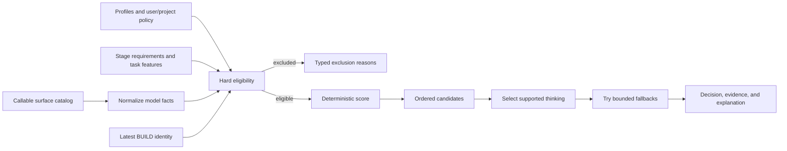

# Capability-aware model routing

**Status:** Shipped; active routing is opt-in

**Fresh-install default:** `routing.engine: "capability-shadow"`

**Decision authority:** Deterministic local policy, not an extra model call

AI Orchestrator chooses models by what a stage requires and what the active surface can prove—not by treating a hardcoded model name as universally best.

The router discovers or loads callable models, applies hard policy, ranks eligible candidates, enforces maker/checker separation, selects a supported thinking level, and returns an ordered fallback list with a complete explanation. Pi can activate the selected local model. MCP can call models from a trusted user catalog. Cursor’s instructions-only workflow can show recommendations but cannot switch the host model.

## Why this exists

Exact global model lists fail in predictable ways:

- a user may have capable authenticated models under different providers or aliases;
- new models otherwise require a package release before they can participate;
- fixed BUILD selection prevents a team from choosing its preferred coding model;
- a fixed judge may accidentally match the maker;
- model names do not prove context capacity, input support, privacy, price, or stage ability;
- fallback and exclusion decisions become impossible to explain.

Capability routing keeps exact pins, but turns them into explicit user policy rather than the definition of suitability.

## Decision flow



The same normalized input and policy produce the same ordered result. No LLM is called merely to choose another LLM.

## Surface behavior

| Surface | Callable-model source | What routing can do |
| --- | --- | --- |
| Pi | `ctx.modelRegistry.getAvailable()` | Rank locally callable models, switch stage model/thinking, persist run evidence |
| MCP | Trusted user `mcp.providers` and `mcp.models` | Preview and call server-side planner/checker candidates |
| Cursor with MCP | Cursor picker plus MCP | User chooses Cursor maker; MCP independently routes its planner/checker |
| Cursor without MCP | User-observed picker | Instructions recommend and record manual handoffs |

Pi ignores `mcp.*` because Pi owns credentials and callability. MCP cannot inspect Pi’s registry, Cursor’s picker, or repository files. Cursor supplies the maker identity as a declaration; the server can enforce its policy against that value but cannot attest which host model Cursor actually ran.

## Routing engines

| Engine | Active behavior | Preview |
| --- | --- | --- |
| `legacy` | Exact role and lifecycle candidate configuration | Capability ranking remains available |
| `capability-shadow` | Exact routes remain active | Capability ranking is recorded for comparison |
| `capability` | Ranked eligible candidates are active | Preview matches active policy |

Shadow mode is the default because model quality, cost, latency, and availability are local to the user. A package test suite cannot establish the best route for every registry or provider.

## Inputs

### Objective model facts

An adapter normalizes only facts it can prove:

- provider and model identity;
- optional family and API type;
- whether it is callable on that surface;
- reasoning support and supported thinking levels;
- text/image input support;
- context window and maximum output;
- input, output, cache-read, and cache-write prices when known;
- privacy classification when trusted policy supplies one.

Credentials, request headers, raw authentication state, and secret values never enter core routing or its evidence.

### Capability profile

Provider metadata cannot prove that a model is good at architecture or review. A versioned `ModelCapabilityProfile` supplies explicit scores for:

- `requirements`
- `architecture`
- `coding`
- `debugging`
- `verification`
- `review`
- `release`
- `structuredOutput`
- `longContext`
- `speed`
- `economy`

Scores and confidence use basis points from `0` to `10000`. Profiles record provenance (`user`, `project`, `builtin`, `observed`, or `inferred`), a version, and an optional family.

Inferred profiles are disabled by default. When enabled, they remain low confidence and must still satisfy the stage’s minimum confidence and capability floors.

### Stage requirements

| Stage | Primary capability goal | Default thinking |
| --- | --- | --- |
| DEFINE | Requirements, ambiguity handling, structured specification | `high` |
| PLAN | Architecture, decomposition, validation design | `high` |
| BUILD | Coding, debugging, reliable tool use | `medium` |
| VERIFY | Acceptance evidence and test interpretation | `medium` |
| DEBUG | Causal diagnosis | `high` |
| REVIEW | Adversarial correctness and architecture review | `high` |
| SHIP | Release risk and rollback synthesis | `high` |
| Fast judge | Combined verification and review | `high` |

High-risk work raises the requested thinking level when the candidate supports it. Unsupported levels are clamped to a supported level and explained.

### Task features

Task features use a closed schema:

- estimated input and output tokens;
- required input types;
- low, medium, or high risk;
- feature, bug fix, refactor, migration, test, documentation, configuration, release, or unknown work;
- touched-file count and languages;
- bounded risk and failure signals.

Unknown is a valid conservative value. Task text cannot create a provider, capability name, policy field, or tool permission.

## Eligibility comes before scoring

A candidate is excluded when any hard rule fails:

- not callable on the active surface;
- provider, model, or family denied;
- not selected by an active pin;
- missing or low-confidence profile;
- capability score below a stage floor;
- required text/image input unsupported;
- context or output capacity too small;
- required reasoning unsupported;
- cost unknown under an exclude policy;
- estimated cost over the ceiling;
- privacy class disallowed;
- exact identity matches the latest maker;
- family separation is required but a distinct family cannot be proven.

The preview returns a typed exclusion code and a human-readable detail for every excluded candidate.

## Scoring

Eligible candidates receive named components:

```text
capability fit
+ task-feature fit
+ profile-confidence bonus
+ provider-family diversity
- estimated-cost penalty
- unknown-cost penalty
```

Stage pins and preferences influence deterministic ordering. Tie-breaking is explicit and stable. The selected decision contains:

- policy version;
- selected provider, model, and family;
- selected and requested thinking level;
- total score and component breakdown;
- eligible and excluded candidates;
- separation result;
- estimated cost when known;
- ordered fallback history;
- content digests that bind the policy, config, candidates, and decision.

## Maker/checker separation

Checker stages are VERIFY, DEBUG, REVIEW, SHIP, and fast judge.

The exact latest BUILD model is ineligible for those stages when separation is enabled. Policy may also require a different family for selected checker stages. A family is accepted only from trusted model/profile metadata; strict policy does not infer it from a model-name substring.

If no eligible checker remains, the run stops with remediation choices. It does not silently fall back to the maker.

## Fallback

The router returns an ordered list. The adapter tries only eligible candidates and stays inside attempt, selection-failure, paid-fallback, and cost budgets.

Fallback categories are typed and sanitized, such as:

- unavailable or unconfigured model;
- authentication or provider failure;
- rate limit or timeout;
- unsupported API or input;
- empty, truncated, or invalid structured output.

A fallback never relaxes privacy, cost, context, capability, pin, or separation requirements. Client abort stops fallback immediately.

For MCP, an invalid judge JSON response can fall through to the next eligible checker. Provider response bodies, endpoint URLs, credentials, and headers are not exposed in the error history.

## Cost policy

Unknown cost is a policy state, never zero. `routing.unknownCost` may exclude, penalize, or allow an unknown-price candidate. Stateful Pi workflows additionally enforce cumulative stage, run, and day ledgers for estimated and observed cost.

Default routing budgets:

| Budget | Default |
| --- | ---: |
| Estimated per stage | 3 USD |
| Estimated per run | 8 USD |
| Observed per run | 8 USD |
| Estimated per day | 24 USD |
| Observed per day | 24 USD |
| Paid fallbacks per run | 2 |

When a provider does not report observed usage, evidence records `unknown`. Corrupt ledger state fails closed.

## Evidence and reviewed improvement

Lifecycle decisions are written to `routing.jsonl`; bounded run outcomes are written to `evidence.jsonl`. Compatible privacy-minimal evidence may also enter the trusted user evidence store.

Evidence may contain:

- model and family identities;
- stage, task category, and bounded feature fields;
- policy/profile versions and decision digests;
- score, selected thinking, and fallback categories;
- token/cost values or `unknown`;
- verdict, BUILD pass, and run outcome.

It excludes prompts, source, diffs, artifact text, credentials, headers, endpoints, repository remotes, and personal paths.

The improvement loop is report-only:

1. `/lifecycle-routing-report` evaluates compatible evidence after the minimum sample count.
2. `/lifecycle-routing-apply N` shows the exact global user-policy change and asks for confirmation.
3. Application writes a private transaction record.
4. `/lifecycle-routing-rollback ID` restores it only if newer policy has not overwritten the same fields.

No unattended process rewrites its own production scoring weights.

## Trust boundaries

Project configuration is repository-controlled input.

On MCP it cannot:

- add providers, endpoints, credentials, or catalog models;
- select credential-receiving legacy roles;
- broaden privacy classes or relabel trusted providers;
- remove trusted deny rules;
- raise trusted cost, attempt, evidence, or circuit-breaker ceilings;
- weaken mandatory maker/checker separation.

Project policy may narrow the trusted catalog and lower ceilings. Provider URLs require HTTPS. API keys accept only a literal or exact `$ENV_VAR` reference; configuration is never evaluated as shell.

Routing chooses a model. It does not choose tools, approve a plan, authorize a worktree, expand graph limits, commit, push, or publish.

## Configuration example

```json
{
  "routing": {
    "engine": "capability-shadow",
    "mode": "balanced",
    "allowInferredProfiles": false,
    "unknownCost": "penalize",
    "privacy": {
      "allowed": ["local", "private"],
      "allowUnknown": false,
      "providers": {
        "acme": "private"
      }
    },
    "deny": {
      "providers": [],
      "models": [],
      "families": []
    },
    "separation": {
      "checkerMustDifferFromBuilder": true,
      "preferDifferentProviderFamily": true,
      "requireDifferentProviderFamilyFor": ["review", "ship"]
    },
    "stages": {
      "build": {
        "prefer": ["family:team-coder"],
        "minimumScores": {
          "coding": 7500
        },
        "thinking": "medium"
      },
      "review": {
        "minimumScores": {
          "review": 8000,
          "architecture": 7000
        },
        "thinking": "high"
      }
    }
  }
}
```

See the [configuration reference](configuration.md) for the complete catalog, profile, budget, and migration examples.

## Migration

### Pi

1. Preview each stage with `/lifecycle-models [stage]`.
2. Add explicit profiles for locally callable candidates.
3. Review exclusions, thinking, cost, and separation.
4. Keep `capability-shadow` until the comparison is acceptable.
5. Set `routing.engine: "capability"` to activate ranking.
6. Return to `legacy` for exact-route rollback.

An unfinished lifecycle freezes its routing identity. After a policy change, run `/lifecycle migrate-routing` and confirm before resume adopts it.

### MCP

1. Keep working `roles.planner` and `roles.judge` for rollback.
2. Add trusted user providers, models, and profiles.
3. Add exact `plan` and `fast-judge` pins when required.
4. Preview both stages with `orchestrator_models`, including the real Cursor `coderIdentity` for the judge.
5. Activate `capability`.
6. Return to `legacy` to restore exact roles.

## Current limitations

- Capability profiles are explicit local claims, not universal benchmark truth.
- Cursor’s actual host model cannot be attested by MCP.
- Gateway models may hide the resolved family; strict family separation can therefore exclude them.
- MCP routing covers its server-side PLAN and fast-judge calls, not Cursor’s coder.
- Evidence produces recommendations, not automatic policy promotion.
- The fresh default remains shadow mode because the project does not ship a representative paid-provider quality corpus.

## Source map

- `src/core/modelRouting.ts` — pure eligibility, scoring, thinking, and explanations
- `src/core/taskFeatures.ts` — deterministic task-feature extraction
- `src/core/routingBudget.ts` — budget and circuit-breaker policy
- `src/core/routingEvidence.ts` — privacy-minimal evidence and recommendations
- `src/adapters/piModelCatalog.ts` — Pi registry normalization
- `src/adapters/piCapabilityRouting.ts` — Pi routing adapter
- `mcp/routing.ts` — trusted MCP catalog routing
- `mcp/routedCompletion.ts` — bounded completion fallback
- `src/core/config.ts` — precedence, defaults, validation, and trust constraints

## Related documents

- [Setup](setup.md)
- [User guide](user-guide.md)
- [Configuration reference](configuration.md)
- [Structured graph architecture](graph-architecture.md)
