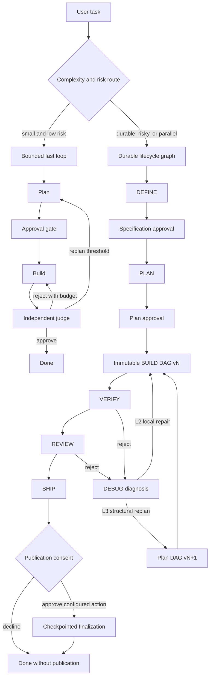
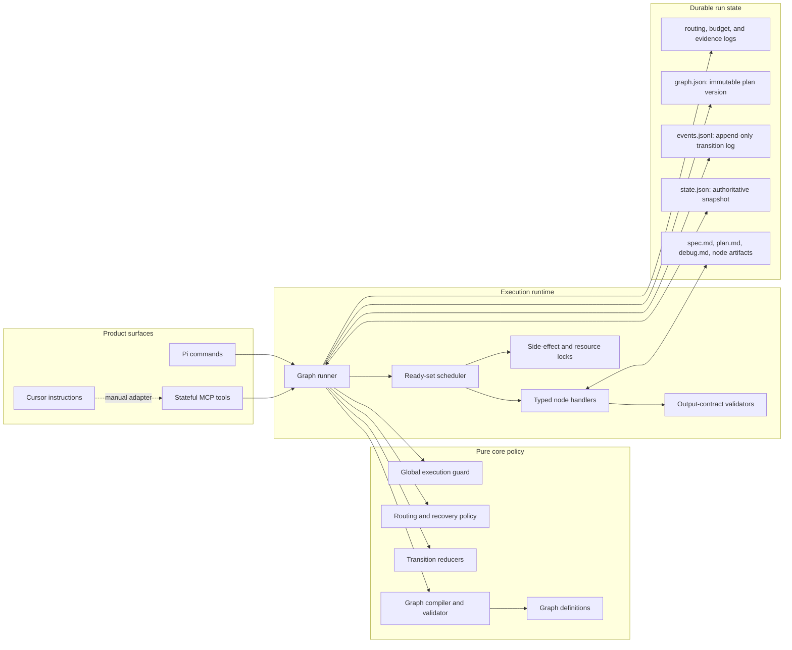
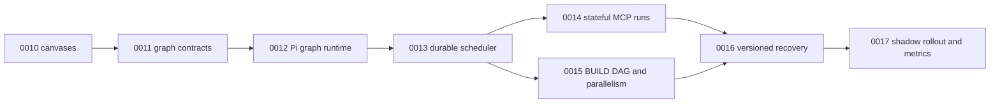
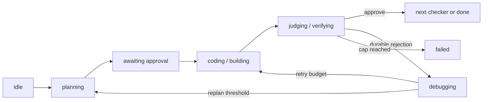

# Structured graph architecture

This document is the durable architecture canvas for AI Orchestrator's migration from implicit control flow to explicit, inspectable graphs. It separates what is shipped today from the target program so operators do not mistake planned files or commands for available behavior.

Today, the pure reducers `nextPhase()` in `src/core/loop.ts` and `nextStage()` in `src/core/lifecycle.ts` remain the only authorities for workflow transitions. The Pi extensions adapt those decisions to models, tools, approvals, and disk. The graph compiler, runner, scheduler, immutable BUILD graph, stateful MCP runs, and versioned recovery shown below are targets for plans 0011 through 0017; they do not exist yet.

## User flow canvas

The product is intentionally hierarchical. A focused task uses the small bounded loop. A durable or risky task uses a lifecycle state graph. In the target architecture, an approved BUILD plan contains an immutable directed acyclic graph, or DAG, whose dependency edges allow conflict-free work to become ready concurrently.



The target recovery controller names its ordered levels L1 bounded retry, L2 local repair, and L3 structural replan. L1 repeats only the failed node within its attempt budget and therefore does not need an outer-lifecycle edge in this canvas. L2 sends typed, read-only DEBUG evidence to BUILD without changing graph topology. L3 creates and validates a new immutable plan version and returns to approval. Budget, authorization, maker/checker-separation, policy, and irreversible-side-effect failures stop or pause outside this ladder; recovery is never a way around a safety gate.

## Runtime architecture canvas

Solid arrows describe the target automated flow. The dotted Cursor edge remains a manual adapter. Every box under “Pure core policy” is project-owned even if a third-party graph framework is later used to execute compiled definitions.



In the target design, graph definitions say what may happen, reducers select valid business transitions, and the scheduler says what is ready to run. Typed handlers perform host work; output-contract validators decide whether their structured results are admissible. A global guard checks attempts, time, cost, graph size, no-progress fingerprints, and side-effect limits before another call begins. Resource locks prevent concurrently ready nodes from writing the same declared resource.

`state.json` remains the authoritative resumable snapshot. `events.jsonl` is a write-ahead log: a bounded structured event is appended before the corresponding atomic snapshot update so interrupted work can be replayed idempotently. Conversation and session entries remain a display mirror, never lifecycle truth.

## Program dependency canvas



Plans 0011 through 0013 are serial because they establish shared types, execution semantics, and persistence. After 0013, stateful MCP work and BUILD-DAG work have distinct surface ownership and may proceed in separate branch worktrees. Plan 0016 integrates both, and plan 0017 is the final serial rollout and retirement gate. Plans are local execution records and are deliberately excluded from the npm package; this document is the packaged operator-facing program index.

## What exists today

The fast reducer uses these internal states: `idle`, `planning`, `awaiting_approval`, `coding`, `judging`, `replanning`, `done`, and `failed`. Its Pi entry points are `/orchestrate` and `/orchestrate-stop`. `judge_verdict` is the terminating structured checker tool.

The lifecycle reducer uses `idle`, `defining`, `awaiting_spec_approval`, `planning`, `awaiting_plan_approval`, `building`, `verifying`, `reviewing`, `debugging`, `shipping`, `awaiting_ship_approval`, `finalizing`, `done`, and `failed`. Its main entry points are `/lifecycle` and `/lifecycle-stop`; `/lifecycle resume` is the resumable invocation, and `/lifecycle migrate-routing` explicitly adopts current routing policy for an unfinished phase. Standalone stage commands are `/spec`, `/plan`, `/build`, `/test`, `/debug`, `/review`, and `/ship`. Routing evidence is managed with `/lifecycle-routing-report`, `/lifecycle-routing-apply`, and `/lifecycle-routing-rollback`. Structured terminating tools are `verify_verdict`, `review_verdict`, `debug_diagnosis`, and `ship_decision`.

The current MCP server is stateless across calls. It exposes `orchestrator_plan`, `orchestrator_judge`, and `orchestrator_models`; Cursor supplies repository context, evidence, and loop counters. “Stateful MCP tools” in the runtime canvas are explicitly a plan-0014 target.

The current transition topology is:



The labels combine the two reducers only to show their shared bounded-loop shape. They do not replace the exact reducer states listed above.

## Current artifact layout

By default, one durable run lives under `.ai-orchestrator/runs/<run-id>/`:

```text
.ai-orchestrator/
├── active-run.json        repository/worktree coordination record
├── current.lock           short-lived coordination lock
└── runs/
    ├── current            active run-id pointer
    └── <run-id>/
        ├── spec.md        DEFINE output
        ├── plan.md        approved PLAN output
        ├── debug.md       latest read-only DEBUG diagnosis
        ├── state.json     authoritative atomic lifecycle snapshot
        ├── journal.md     append-only human-readable transition journal
        ├── routing.jsonl  bounded structured routing decisions
        ├── evidence.jsonl privacy-minimized run evidence
        └── execution.lock active executor lease
```

`src/lifecycle/artifacts.ts` owns this layout, path containment, symlink rejection, atomic state replacement, the active-run pointer, and execution leases. The run directory is excluded from Git. Source work is never automatically stashed, reset, cleaned, checked out, or reverted.

## Target artifact layout

Plans 0013 through 0016 extend the current layout without silently rewriting historical evidence:

```text
.ai-orchestrator/runs/<run-id>/
├── graph.json                  immutable compiled outer graph
├── state.json                  authoritative graph snapshot, schema v2+
├── events.jsonl                structured write-ahead transition events
├── spec.md
├── plan.md                     current approved human-readable plan
├── debug.md
├── routing.jsonl
├── evidence.jsonl
├── journal.md
├── nodes/                      outputs addressed by plan version and node id
└── plan-versions/
    └── <N>/
        ├── graph.json          immutable BUILD DAG for version N
        ├── plan.md
        ├── approval.json
        └── lineage.json        predecessor and replan reason
```

The exact schemas and filenames become contracts only when their owning plans land. Version N is frozen after approval. Repair may produce new node outputs but cannot edit its topology; structural replan creates version N+1. A stale output from one version cannot satisfy another version's declared contract.

## Glossary

- **Node:** one named unit of work with declared inputs, outputs, tools, model policy, timeout, retry budget, and side-effect class.
- **Edge:** a permitted state transition or a BUILD data dependency between two nodes.
- **Conditional route:** an edge selected by a deterministic code guard from validated state or typed output, never from unparsed model prose.
- **Ready set:** nodes whose dependencies and guards are satisfied. State-machine graphs normally have one ready node; a BUILD DAG may have several.
- **Plan version:** one immutable approved plan and compiled graph definition. Structural recovery creates a successor version instead of mutating the current version.
- **Recovery level:** one ordered response to failure: L1 bounded retry, L2 typed local repair through read-only DEBUG and BUILD, or L3 approved structural replan. Safety stops are not recovery levels.
- **Output contract:** the schema and validation rules a node result must satisfy before any outgoing edge can be selected.
- **Side-effect class:** a declaration of what a node may change, such as read-only inspection, artifact-only writing, source mutation, or an externally visible action that requires a gate.
- **Snapshot:** the complete authoritative state needed to resume a run at a durable boundary; today this is `state.json`.
- **Write-ahead log:** an append-only sequence of structured transition events written before snapshot advancement so replay can recover an interrupted update; the target file is `events.jsonl`.

## Invariants across the migration

The repository, not a model conversation, remembers run state. A model that edits code does not approve its own work. DEFINE and PLAN may write only their declared artifacts; VERIFY, REVIEW, DEBUG, and SHIP are read-only; BUILD alone may edit source. Structured verdict tools end checker turns. Every cycle consumes a monotonic budget. Human approval and publication consent remain explicit, and SHIP never pushes.

Graph libraries may be execution adapters, but they are not policy authorities. In particular, adopting LangGraph would not move graph schemas, transition guards, model separation, side-effect permissions, recovery selection, termination limits, or durable state ownership out of this repository's pure core and adapters.
