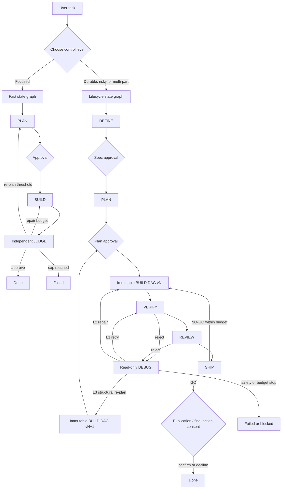
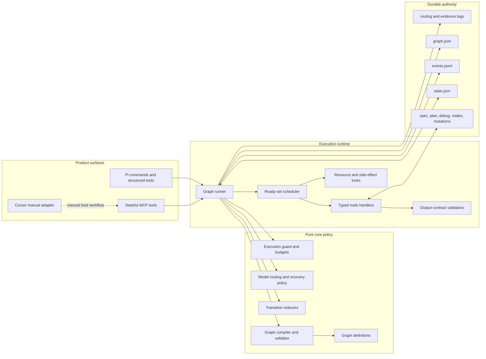
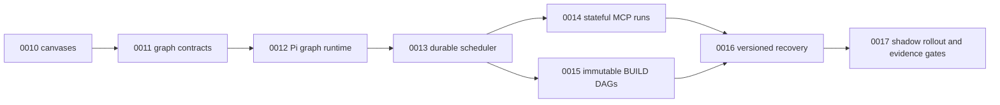

# Structured graph architecture

AI Orchestrator uses explicit graphs to make workflow state, BUILD dependencies, retries, side effects, and recovery inspectable. The graph runtime does not move product policy into model prose: pure reducers still decide business transitions, typed contracts validate outputs, and durable storage records what actually happened.

Fresh installs use `execution.engine: "graph-shadow"`. The compiled graph checks each reducer-selected transition while `nextPhase()` and `nextStage()` remain authoritative. Active graph execution is a trusted-user opt-in until representative field evidence and a released compatibility window satisfy the rollout gate.

## User flow canvas

A focused task uses the bounded fast loop. Work that needs a specification, durable resume, independent VERIFY and REVIEW, or a multi-node BUILD uses the lifecycle. The lifecycle PLAN produces an immutable BUILD DAG whose dependency edges determine which nodes are ready.


```mermaid
flowchart TB
    U["User task"] --> C{"Choose control level"}

    C -->|"Focused"| F["Fast state graph"]
    F --> FP["PLAN"] --> FA{"Approval"} --> FB["BUILD"] --> FJ["Independent JUDGE"]
    FJ -->|"approve"| FD["Done"]
    FJ -->|"repair budget"| FB
    FJ -->|"re-plan threshold"| FP
    FJ -->|"cap reached"| FX["Failed"]

    C -->|"Durable, risky, or multi-part"| L["Lifecycle state graph"]
    L --> LD["DEFINE"] --> LS{"Spec approval"} --> LP["PLAN"] --> LA{"Plan approval"}
    LA --> BD["Immutable BUILD DAG vN"] --> LV["VERIFY"] --> LR["REVIEW"] --> SH["SHIP"]
    LV -->|"reject"| DG["Read-only DEBUG"]
    LR -->|"reject"| DG
    DG -->|"L1 retry"| LV
    DG -->|"L2 repair"| BD
    DG -->|"L3 structural re-plan"| PN["Immutable BUILD DAG vN+1"] --> LA
    SH -->|"GO"| PG{"Publication / final-action consent"}
    PG -->|"confirm or decline"| DONE["Done"]
    SH -->|"NO-GO within budget"| BD
    DG -->|"safety or budget stop"| LX["Failed or blocked"]
```

L1 retries the exact failed action within its frozen budget. L2 keeps the approved topology and sends typed diagnosis evidence to BUILD. L3 reserves a successor plan version, authenticates its artifacts, and returns to approval. Authorization, policy, configuration, uncertain-side-effect, and global-budget failures stop or pause outside the recovery ladder.

## Runtime architecture canvas


```mermaid
flowchart LR
    subgraph Surface["Product surfaces"]
        PI["Pi commands and structured tools"]
        MCP["Stateful MCP tools"]
        CUR["Cursor manual adapter"]
    end

    subgraph Core["Pure core policy"]
        DEF["Graph definitions"]
        COMP["Graph compiler and validator"]
        RED["Transition reducers"]
        ROUTE["Model routing and recovery policy"]
        GUARD["Execution guard and budgets"]
    end

    subgraph Run["Execution runtime"]
        GR["Graph runner"]
        READY["Ready-set scheduler"]
        NODE["Typed node handlers"]
        VALID["Output-contract validators"]
        LOCK["Resource and side-effect locks"]
    end

    subgraph State["Durable authority"]
        G["graph.json"]
        S["state.json"]
        E["events.jsonl"]
        A["spec, plan, debug, nodes, mutations"]
        R["routing and evidence logs"]
    end

    PI --> GR
    MCP --> GR
    CUR -. "manual host workflow" .-> MCP
    GR --> COMP --> DEF
    GR --> RED
    GR --> ROUTE
    GR --> GUARD
    GR --> READY --> NODE --> VALID
    READY --> LOCK
    GR <--> S
    GR --> E
    GR --> G
    NODE <--> A
    GR --> R
```

The layers have different jobs:

- **Graph definitions** enumerate nodes, edges, guards, contracts, retry budgets, timeouts, and side-effect classes.
- **Reducers** choose the next valid business transition.
- **The scheduler** computes readiness and enforces the frozen execution envelope.
- **Handlers** adapt a typed node to Pi, MCP, Git, filesystem, or human-gate work.
- **Validators** accept or reject structured outputs before a transition can commit.
- **Checkpoints** bind effects, outputs, and state changes to an append-only event head.

The core is pure. Filesystem, Pi, MCP, and Git adapters may import it; core modules never import those surfaces.

## Three graph levels

### Workflow state graph

The outer fast and lifecycle graphs describe legal phases and transitions. They make approval, checker, DEBUG, SHIP, cancellation, retry, and terminal edges explicit.

### Immutable BUILD DAG

Lifecycle PLAN submits schema-versioned nodes and dependencies through `submit_build_plan`. Compilation rejects:

- duplicate or missing node and contract references;
- cycles and unreachable nodes;
- invalid entry, exit, join, side-effect, or tool policies;
- unsafe shared writers;
- isolated writers without declared write sets, validation, and human integration;
- unbounded retry, timeout, graph-size, or concurrency declarations.

Plan version N is immutable after submission. L2 repair can generate new node outputs but cannot rewrite its topology. L3 creates N+1 and requires separate approval.

### Recovery graph

Recovery authority is derived from durable failure evidence and the exact scheduler event head. One frozen lineage tracks consumed retry, repair, and re-plan budgets across plan versions. A client or model cannot author its own failure category to gain a recovery action.

## Program dependency canvas

The graph program landed in dependency order. The plan names below are historical implementation slices; local plan files are not package documentation.


```mermaid
flowchart LR
    P10["0010 canvases"] --> P11["0011 graph contracts"] --> P12["0012 Pi graph runtime"]
    P12 --> P13["0013 durable scheduler"]
    P13 --> P14["0014 stateful MCP runs"]
    P13 --> P15["0015 immutable BUILD DAGs"]
    P14 --> P16["0016 versioned recovery"]
    P15 --> P16
    P16 --> P17["0017 shadow rollout and evidence gates"]
```

The owning plans have landed their schemas and validation contracts. Their implementation added:

1. graph definitions, compilation, and reducer characterization;
2. Pi graph adapters;
3. generation-bound leases, a write-ahead event chain, atomic snapshots, and replay;
4. durable server-owned MCP runs with optimistic concurrency and request receipts;
5. immutable BUILD plans, ready-set scheduling, isolated worktrees, and manual integration;
6. typed retry, repair, successor-plan recovery, and authenticated lineage;
7. privacy-minimal release evidence, trust-aware execution routing, and a deterministic rollout verifier.

## Exact workflow topology


```mermaid
flowchart TB
    subgraph Fast["Fast reducer"]
        FI["idle"] --> FP["planning"] --> FA["awaiting_approval"] --> FC["coding"] --> FJ["judging"]
        FJ -->|"approve"| FD["done"]
        FJ -->|"retry"| FC
        FJ -->|"re-plan"| FR["replanning"] --> FA
        FJ -->|"cap/provider failure"| FF["failed"]
    end

    subgraph Lifecycle["Lifecycle reducer"]
        LI["idle"] --> LD["defining"] --> LSA["awaiting_spec_approval"] --> LP["planning"]
        LP --> LPA["awaiting_plan_approval"] --> LB["building"] --> LV["verifying"]
        LV -->|"approve"| LR["reviewing"] -->|"approve"| LS["shipping"]
        LV -->|"reject"| LG["debugging"]
        LR -->|"reject"| LG
        LG -->|"checker retry"| LV
        LG -->|"local repair"| LB
        LG -->|"re-plan"| LP
        LS -->|"GO"| LAA["awaiting_ship_approval"] --> LF["finalizing"] --> LDone["done"]
        LS -->|"NO-GO"| LB
        LG -->|"cap"| LFail["failed"]
    end
```

The exact fast phases are `idle`, `planning`, `awaiting_approval`, `coding`, `judging`, `replanning`, `done`, and `failed`.

The exact lifecycle phases are `idle`, `defining`, `awaiting_spec_approval`, `planning`, `awaiting_plan_approval`, `building`, `verifying`, `reviewing`, `debugging`, `shipping`, `awaiting_ship_approval`, `finalizing`, `done`, and `failed`.

The diagram compresses revision, yolo, cancellation, checker-retry, SHIP-decline, and finalization edges for readability. The compiled definitions and reducers are the executable source.

## Product entry points

### Pi commands

Fast path:

- `/orchestrate`
- `/orchestrate-stop`

Lifecycle and routing:

- `/lifecycle`
- `/lifecycle-stop`
- `/lifecycle-models`
- `/lifecycle-routing-report`
- `/lifecycle-routing-apply`
- `/lifecycle-routing-rollback`
- `/spec`
- `/plan`
- `/build`
- `/test`
- `/debug`
- `/review`
- `/ship`

### Pi terminating tools

- `judge_verdict`
- `submit_build_plan`
- `verify_verdict`
- `review_verdict`
- `debug_diagnosis`
- `ship_decision`

These tools end their phase with schema-validated output. Verdicts are never parsed from free-form prose.

### MCP tools

Preferred durable protocol:

- `orchestrator_run_start`
- `orchestrator_run_get`
- `orchestrator_run_advance`
- `orchestrator_run_recover`
- `orchestrator_run_cancel`

Read-only routing preview and compatibility protocol:

- `orchestrator_models`
- `orchestrator_plan`
- `orchestrator_judge`

The durable service owns current node, revision, plan version, counters, permitted client events, checker route, provider-attempt receipts, budgets, recovery lineage, and terminal state. Clients submit observations; they do not choose transitions.

## Lifecycle artifact layout

One default run is stored beneath `.ai-orchestrator/runs/<run-id>/`:

```text
.ai-orchestrator/
├── active-run.json
├── current.lock
└── runs/
    ├── current
    └── <run-id>/
        ├── spec.md
        ├── plan.md
        ├── debug.md
        ├── state.json
        ├── journal.md
        ├── routing.jsonl
        ├── evidence.jsonl
        ├── graph.json
        ├── events.jsonl
        ├── execution.lock
        ├── nodes/
        ├── mutations/
        └── build/
            ├── plan-reservations/
            ├── plan-versions/
            │   └── <N>/
            │       ├── plan.graph.json
            │       ├── plan.md
            │       └── manifest.json
            └── execution/
                └── plan-versions/
```

The names `spec.md`, `plan.md`, `debug.md`, `state.json`, `journal.md`, `routing.jsonl`, `evidence.jsonl`, `graph.json`, `events.jsonl`, `nodes`, `mutations`, and `execution.lock` are part of the current disk-adapter contract.

`state.json` is the authoritative atomic snapshot. `events.jsonl` is a bounded append-only write-ahead chain. `graph.json` is the compiled outer workflow definition. `nodes/` and `mutations/` store content-addressed output and side-effect evidence. The generated top-level `plan.md` mirrors the active immutable plan version for readers.

`src/lifecycle/artifacts.ts` owns containment, symlink rejection, atomic replacement, current-run coordination, and lease operations. The working tree is never automatically stashed, reset, cleaned, checked out, or reverted.

## Checkpoint and replay semantics

A checkpoint lease contains an owner and generation. Every append verifies:

- the exact expected event head;
- the same live lease generation immediately before write;
- canonical bounded event bytes;
- referenced graph, output, and mutation digests;
- monotonic scheduler state and frozen execution limits.

Effects use intent/result pairs. Model, write, external, and irreversible effects bind the intent to an immutable request artifact. A successful result references immutable output bytes. If dispatch may have occurred but the result is uncertain, the durable status becomes unknown and automatic replay stops.

Replay does not silently truncate corrupt history. Missing, changed, reordered, substituted, or truncated authority requires reviewed operator recovery.

## BUILD scheduling and worktrees

The ready set contains nodes whose dependencies, contracts, and guards are satisfied. Resource locks and declared write sets decide whether ready nodes may run together.

- Read-only nodes may fan out within global and model concurrency limits.
- Shared writers remain sequential.
- Isolated writers require worktree ownership, verified disjoint write sets, and explicit user approval.
- Each isolated branch uses a deterministic contained `codex/build/...` identity.
- The runtime never merges, commits, cleans, pushes, or publishes a candidate.
- A final human-integration node records what the user actually integrated and validates the main workspace afterward.

Worktree isolation prevents file collisions. It does not replace human review or make integration safe by itself.

## Stateful MCP authority

MCP run authority lives under the trusted user store, partitioned by a digest of the canonical repository path. The optional project mirror is status-only.

Every mutation has:

- an opaque server run ID;
- an exact expected revision;
- a client idempotency key;
- a closed-schema client event;
- a durable request receipt;
- an atomic next snapshot.

The same request ID and body replays the original response after restart. A changed body under the same key is rejected. A stale revision returns a conflict and the current state.

Provider output is written content-addressed before a successful transition becomes visible. Recovery anchors to the scheduler event head that closed the failure, so a restart cannot swap in different evidence or reset the consumed recovery budget.

## Execution and routing remain separate

Graph execution decides how a valid transition runs. Capability routing decides which eligible model may perform a stage.

| Layer | Compatibility | Shadow | Active |
| --- | --- | --- | --- |
| Model routing | `legacy` | `capability-shadow` | `capability` |
| Graph execution | `legacy` | `graph-shadow` | `graph` |

A routing score cannot grant a tool, skip approval, expand an execution limit, or authorize publication. A graph edge cannot make an untrusted model eligible.

## Rollout status

The current decision is **keep `graph-shadow`**.

The repository has unit, integration, replay, recovery, BUILD-DAG, security-boundary, and adversarial release-store tests. Those tests prove implementation contracts. They do not prove that active graph execution is non-inferior on representative real work.

Promotion requires a complete manifest-bound G0–G6 matrix across eight task categories with at least ten distinct paired cases in every cell. Reports replay observed stage events, accepted checker order, contracts, costs, tokens, retries, recovery, and receipt-backed concurrency. Unknown and incomplete evidence stays negative or unknown; it is never assumed favorable.

`ai-orchestrator graph-rollout-report <release-version>` reads canonical files beneath `~/.ai-orchestrator/graph-releases/<release-version>/`, recomputes the report, and verifies coverage, rollback, migration, and any claimed later compatibility releases. It accepts no caller-selected root, returns no raw events, performs no network call, and changes no configuration.

Valid rollout outcomes are:

1. keep `graph-shadow`;
2. enable sequential `graph`;
3. enable graph DAG execution while keeping parallel writes opt-in.

Legacy retirement additionally requires at least one later released compatibility window and clean package/config rollback evidence. Neither condition exists in this repository today.

## Invariants

- The repository remembers; the model does not.
- `nextPhase()` and `nextStage()` remain business-policy authorities during shadow rollout.
- A maker cannot approve its own output.
- DEFINE writes only its specification artifact.
- PLAN submits only its immutable BUILD plan.
- BUILD is the only source-mutating lifecycle phase.
- VERIFY, REVIEW, DEBUG, and SHIP are read-only.
- Structured tools terminate checker and decision phases.
- Every loop and recovery edge consumes a finite budget.
- Durable state changes are atomic and replayable.
- Publication requires user authority; SHIP never pushes.

## Glossary

- **Node:** one typed unit of work with declared contracts, tools, timeout, retry budget, and side-effect class.
- **Edge:** a permitted state transition or BUILD dependency.
- **Ready set:** nodes whose dependencies and guards are satisfied.
- **Plan version:** one immutable compiled BUILD graph plus human-readable plan and manifest.
- **Output contract:** validation required before a node result can satisfy a dependency.
- **Side-effect class:** `none`, read, write, external, or irreversible authority.
- **Snapshot:** the complete durable state needed to resume; lifecycle uses `state.json`.
- **Write-ahead log:** events appended before snapshot advancement; lifecycle uses `events.jsonl`.
- **Recovery lineage:** immutable authority tying one failure and its consumed retry/repair/re-plan budgets across plan versions.

## Related documents

- [User guide](user-guide.md)
- [Configuration reference](configuration.md)
- [Capability-aware routing](adaptive-capability-model-routing-prd.md)
