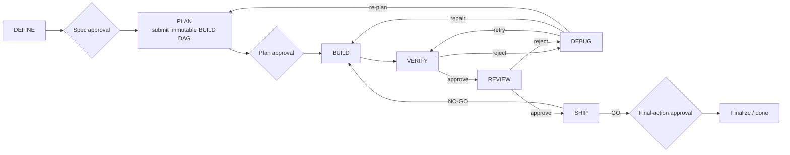

# Use AI Orchestrator

AI Orchestrator gives an AI coding task explicit roles, durable boundaries, and bounded outcomes. The maker may edit code; the checker may approve or reject it; the user owns approvals and publication.

Complete [setup](setup.md), then choose the smallest workflow that gives the task enough control.

| Workflow | Use when | Durable authority |
| --- | --- | --- |
| Pi `/orchestrate` | A focused change needs plan approval and independent judgment | Pi session only |
| Pi `/lifecycle` | Work needs a specification, restart-safe state, multiple checks, a BUILD graph, or recovery | Repository run directory |
| Cursor with MCP | Cursor remains the coder while trusted server-side models plan and judge | Trusted user MCP run store |
| Cursor without MCP | MCP is unavailable and model handoffs can be performed manually | Your own records |

## Rules that never change

1. Approve the plan before source edits unless the run was explicitly started with supported `--yolo` behavior.
2. Record the actual maker identity. A checker must differ from the latest maker; configured family separation may be stricter.
3. Treat routing metadata and model prose as evidence, never as permission.
4. DEBUG diagnoses. BUILD edits.
5. VERIFY, REVIEW, DEBUG, and SHIP remain source-read-only.
6. Stop when an independent checker or required evidence is unavailable.
7. AI Orchestrator never pushes and never automatically stashes, resets, cleans, checks out, or reverts the working tree.
8. Commit and pull-request actions require configuration support and fresh confirmation for the current state.

## Pi fast path

Start a focused Plan → Code → Judge loop:

```text
/orchestrate add a --version flag to the CLI
```

Commands:

```text
/orchestrate <task>          Start with plan approval
/orchestrate --yolo <task>   Skip only the plan-approval pause
/orchestrate-stop            Cancel and restore the prior Pi state
```

The run:

1. selects and runs a planner;
2. shows the plan and waits for approval;
3. selects a coding-capable maker and exposes only the active run’s allowed BUILD tools;
4. blocks destructive Git, staging, commits, tags, pushes, pull requests, publishing, and orchestrator-metadata mutation;
5. switches to an independent read-only judge;
6. optionally runs the exact detected test command;
7. requires one structured `judge_verdict`;
8. returns actionable fixes to BUILD, re-plans after repeated rejection, or stops at the configured cap;
9. restores the model, thinking level, and active tools selected before the run.

Defaults:

- three total coding passes;
- re-plan after two consecutive checker rejections;
- plan approval required;
- test execution enabled.

The fast path does not create a lifecycle run directory. If Pi exits during the run, inspect the working tree and start a new run; do not treat conversation state as durable authority.

## Pi durable lifecycle

Start a full lifecycle:

```text
/lifecycle implement resumable export processing
```



### Commands

```text
/lifecycle [--yolo] <task>      Start and drive a full run
/lifecycle resume               Resume the active run from disk
/lifecycle migrate-routing      Confirm policy migration for unfinished work
/lifecycle-stop                 Cancel and preserve the run directory
/lifecycle-models [stage]       Preview routing without invoking a model
/lifecycle-routing-report       Show evidence-bounded recommendations
/lifecycle-routing-apply N      Confirm recommendation N as user policy
/lifecycle-routing-rollback ID  Confirm exact rollback of that preference
/spec [--yolo] <idea>           Run DEFINE at the saved phase
/plan                           Run PLAN at the saved phase
/build                          Run BUILD at the saved phase
/test                           Run VERIFY at the saved phase
/debug                          Run DEBUG at the saved phase
/review                         Run REVIEW at the saved phase
/ship                           Run SHIP at the saved phase
```

Standalone commands neither skip nor rewind `state.json`. If the command does not match the saved phase, AI Orchestrator reports the current phase and expected next action.

Lifecycle `--yolo` skips the supported specification, plan, and SHIP approval pauses. It does not grant worktree trust, concurrent writes, candidate integration, commit, pull-request, push, or publication consent.

### DEFINE

DEFINE turns the request into an acceptance contract:

- objective and users;
- independently testable acceptance criteria;
- non-goals and constraints;
- always-do, ask-first, and never-do boundaries.

It may inspect the repository read-only and write only `spec.md`. When requirements are ambiguous, it should ask one grouped set of clarification questions.

### PLAN

PLAN reads the approved specification and produces a structured BUILD DAG. It must finish by calling `submit_build_plan` exactly once.

Each node declares:

- a stable ID, handler, priority, objective, and ordered instructions;
- acceptance criteria and exact verification commands;
- input and output contracts;
- tool and side-effect policy;
- shared or isolated-worktree execution;
- resource locks and a write set;
- retry and timeout limits.

The extension validates the graph, rejects cycles and unsafe contracts, reserves the next plan version, writes canonical graph/manifest artifacts, generates the human-readable `plan.md`, and freezes that version. PLAN cannot edit source or write plan files directly.

### BUILD

BUILD executes the approved graph:

- read-only work may fan out within configured concurrency limits;
- shared source writers are serialized;
- isolated writers require declared disjoint write sets and worktree ownership;
- every worker receives bounded read/search/edit tools and declared-write authority;
- reviewed validation commands run through a closed registry;
- node outputs and side-effect receipts are immutable and content-addressed.

Before isolated writers run, the UI separately asks permission to:

1. create contained Git worktrees;
2. trust repository checkout behavior;
3. run multiple isolated writers concurrently, when applicable.

Candidate branches are not merged automatically. A human integration node shows each candidate, changed paths, and validation evidence. You integrate and commit selected candidates manually, then confirm what happened. Declined or paused candidates and worktrees are preserved for inspection.

### VERIFY

VERIFY is read-only. It runs only reviewed inspection commands and, when enabled, the exact detected test command. It checks every acceptance criterion and plan node against the current tree and finishes with exactly one `verify_verdict`.

Approval moves to REVIEW. Rejection moves to DEBUG.

### REVIEW

REVIEW is read-only and independent from the latest BUILD identity. It examines:

- correctness and completeness;
- architecture fit and maintainability;
- security and privacy;
- performance and concurrency risk;
- regressions and unrelated changes.

It cites concrete evidence and finishes with exactly one `review_verdict`. Approval moves to SHIP; rejection moves to DEBUG.

### DEBUG and recovery

DEBUG never edits source. It reproduces or inspects the failure with permitted read-only commands, distinguishes evidence from hypothesis, identifies root cause and confidence, scopes the repair, defines validation, and finishes with `debug_diagnosis`.

The durable recovery controller then chooses one bounded action:

| Level | Action | Topology |
| --- | --- | --- |
| L1 | Retry the exact transiently failed action | Unchanged |
| L2 | Return a typed diagnosis to BUILD for a local repair | Approved plan version unchanged |
| L3 | Create a successor plan and return to approval | New immutable plan version |

Budget exhaustion, missing authorization, policy conflicts, configuration changes, uncertain side effects, or unprovable evidence pause or fail outside this ladder. Recovery cannot invent authority.

### SHIP

SHIP is a read-only release decision. It reports:

- GO or NO-GO;
- blockers and residual risks;
- required fixes;
- a concrete rollback plan.

A NO-GO returns to BUILD, PLAN, or failure under the same bounded loop policy. A GO may offer configured commit or pull-request finalization after fresh confirmation.

SHIP never pushes. Pull-request creation requires an already-pushed upstream whose tip exactly matches local `HEAD`.

## Durable lifecycle state

The repository, not the conversation, remembers:

```text
<git-worktree>/.ai-orchestrator/
├── active-run.json
└── current.lock

<run-start-cwd>/<lifecycle.artifactsDir>/
├── current
└── <run-id>/
    ├── spec.md
    ├── plan.md
    ├── debug.md
    ├── state.json
    ├── journal.md
    ├── routing.jsonl
    ├── evidence.jsonl
    ├── graph.json
    ├── events.jsonl
    ├── execution.lock
    ├── nodes/
    ├── mutations/
    └── build/
        ├── plan-reservations/
        ├── plan-versions/
        │   └── <N>/
        │       ├── plan.graph.json
        │       ├── plan.md
        │       └── manifest.json
        └── execution/
            └── plan-versions/
```

`lifecycle.artifactsDir` defaults to `.ai-orchestrator/runs` relative to the directory where the run starts. Worktree-wide coordination remains at the Git worktree root.

`state.json` is the authoritative atomic snapshot. `events.jsonl` is the bounded append-only write-ahead event chain. Immutable graph, node, mutation, plan, approval, and recovery evidence is verified during replay. Missing, substituted, truncated, or corrupt authority fails closed.

`current.lock` and `execution.lock` are transient coordination files. A generation-bound execution lease prevents stale processes from appending events after ownership changes.

### Resume

After interruption:

```text
/lifecycle resume
```

Resume:

1. resolves the active run and obtains its execution lease;
2. authenticates the graph, event chain, snapshot, and referenced evidence;
3. reconciles any known pending side-effect intent;
4. restores the exact saved phase, routing policy identity, counters, and budgets;
5. continues only from a safe durable boundary.

An effect whose dispatch may have occurred but whose result is unknown is not replayed automatically. It stops for reconciliation.

`/lifecycle-stop` cancels and releases the active pointer while preserving files. It is not a pause command and does not promise that the stopped run can later resume.

### Routing changes during a run

A lifecycle run freezes its routing and role policy identity. If configuration changes before completion, resume pauses.

1. Review the new configuration.
2. Run `/lifecycle migrate-routing`.
3. Confirm adoption.
4. Resume if the phase did not continue automatically.

Completed selections remain historical evidence.

### Routing reports

`/lifecycle-routing-report` is read-only and requires the configured minimum compatible evidence.

`/lifecycle-routing-apply <number>` changes trusted user policy, not repository policy. It shows the stage, sample basis, trade-off, and global scope before confirmation. Application writes a private versioned transaction record.

`/lifecycle-routing-rollback <id>` restores only that transaction and only when the changed fields still match. It refuses to overwrite newer user policy.

## Cursor with durable MCP runs

Cursor remains the maker. The MCP server plans, selects independent server-side checkers, owns counters and recovery, and persists run authority beneath the trusted user directory.

### Start

1. Select the Cursor coding model.
2. Record its exact `provider/model` identity as `coderIdentity`.
3. Create a fresh client `requestId`.
4. Call `orchestrator_run_start` with the task, optional bounded repository context/features, and `coderIdentity`.
5. Save the returned opaque `runId` and exact `revision`.
6. Show the returned plan to the user.

The server always returns the first plan in `awaiting_approval`.

### Approve or revise

Call `orchestrator_run_advance` with:

- a new `requestId`;
- the exact current `runId`;
- the exact `expectedRevision`;
- `plan_approved`, or `plan_revision_requested` with feedback.

Every replacement plan requires separate approval.

### Build and submit evidence

Implement only while `currentNode` is `coding`. Collect:

- unstaged and staged Git diff;
- relevant test output;
- the actual Cursor maker identity already frozen into the run.

Submit `code_result_submitted` at the exact current revision. The server selects the checker, persists provider-output evidence before exposing success, computes the next state, updates counters, and returns the only permitted next events.

### Conflicts and idempotency

Reuse a `requestId` only when retrying the exact same request after a lost response.

If the server returns a revision conflict:

1. call `orchestrator_run_get`;
2. reconcile `currentNode`, `revision`, `permittedEvents`, and `requiredAction`;
3. use a new request ID for any changed request body.

Never guess counters or advance an event not listed in `permittedEvents`.

### Recover

Call `orchestrator_run_recover` only after the server has durably closed a provider failure or checker rejection.

The client supplies only the run ID, exact revision, and request ID. It does not supply a failure category or diagnosis. The server derives the occurrence from its event chain, runs independent read-only DEBUG when required, consumes the frozen retry/repair/re-plan budget, and returns the next permitted action.

A structural re-plan creates immutable version N+1 and pauses for approval before activation.

### Cancel

Use `orchestrator_run_cancel` with the exact revision. Cancellation retains evidence for inspection.

## Cursor compatibility and manual modes

`orchestrator_plan` and `orchestrator_judge` remain available for clients that own their own loop. The client must pass the current plan, diff, test output, maker identity, iteration, and consecutive-rejection counters exactly as returned by the previous call.

Without MCP:

1. inspect and write a plan;
2. obtain explicit approval;
3. select and record a coding-capable maker;
4. implement and test;
5. switch to and record an independent checker;
6. address every rejection;
7. re-plan after two consecutive rejections by default;
8. stop after three coding passes by default;
9. fail closed if independence cannot be proven.

Do not describe same-model review as independent.

## Graph rollout

`execution.engine: "graph-shadow"` remains the default. The graph is compiled and checked, but the pure `nextPhase()` and `nextStage()` reducer result remains transition authority.

Use trusted user `"engine": "graph"` only for deliberate evaluation. Return to `"graph-shadow"` for immediate rollback or `"legacy"` if the shadow check itself must be disabled.

Check one canonical release bundle:

```sh
ai-orchestrator graph-rollout-report 1.2.3
```

The repository’s synthetic and adversarial tests prove the verifier contract. They do not constitute the representative real-work corpus, paid-provider comparison, or later released compatibility window required to promote graph mode or remove the compatibility path.

## Publication and cleanup

Before any final action:

1. inspect the complete working tree;
2. confirm all selected BUILD candidates were intentionally integrated;
3. read VERIFY, REVIEW, and SHIP evidence;
4. confirm the upstream and `HEAD` state;
5. approve the exact offered action.

Declining publication may still finish a successful run. AI Orchestrator does not interpret “done” as permission to push.

Remove terminal run directories only after retaining required evidence. Never edit active metadata to force a transition.

## Help

- [Setup](setup.md)
- [Configuration](configuration.md)
- [Structured graph architecture](graph-architecture.md)
- [Capability-aware routing](adaptive-capability-model-routing-prd.md)
- [Project issues](https://github.com/nguyen-ta-cuong/ai-orchestrator/issues)
